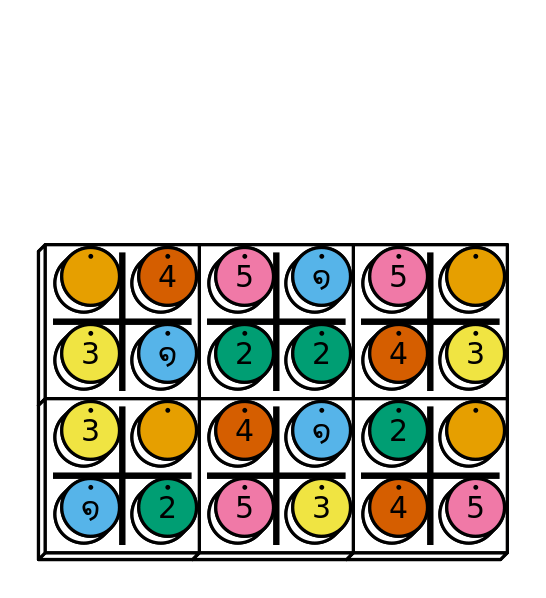

# ppn

[](https://cran.r-project.org/package=ppn)
[](https://github.com/piecepackr/ppn/actions)
[](https://app.codecov.io/github/piecepackr/ppn)

### Table of Contents

* [Overview](#overview)
* [Installation](#installation)
* [Examples](#examples)
* [Related links](#links)

## <a name="overview">Overview</a>

* `read_ppn()` parses board games recorded in [Portable Piecepack Notation (PPN)](https://trevorldavis.com/piecepackr/portable-piecepack-notation.html) format.
* If the suggested [{piecepackr}](https://www.github.com/piecepackr/piecepackr) package is installed then parsed games can be visualized with  `{grid}`, `{ggplot2}`, `{rayrender}`, `{rayvertex}`, or `{rgl}` using `plot_move()` and `animate_game()`.
* If the suggested [{ppcli}](https://www.github.com/piecepackr/ppcli) package is installed then parsed games can be visualized in the terminal with `{cli}` using `cat_move()` and `cat_game()`.
* Has built-in setups for 100+ games playable with public domain game systems via use of the [{ppdf}](https://www.github.com/piecepackr/ppdf) package.  Allows users to write custom setup functions for additional games and board game systems.
* `view_game()` lets you interactively view and edit PPN recorded games with your choice of either a `{shiny}` web interface or `{cli}` command-line interface.
* This is an extraction and refinement of functionality originally contained in the experimental [{ppgames}](https://www.github.com/piecepackr/ppgames) package.

## <a name="installation">Installation</a>


```r
remotes::install_github("piecepackr/ppn")
```

## <a name="examples">Examples</a>


```r
ppn_file <- system.file("ppn/relativity.ppn", package = "ppn")
cat(paste("\t", readLines(ppn_file)), sep = "\n")
```

	 ---
	 Round: Night
	 GameType: 
	     Name: Relativity
	     Coins: "n45a5n/3a2243/3n4a2n/a25345"
	 ...
	 { Notes: Space has power of adjacency while Time has power of sequence }
	 1S. d3#e3 1T. d3#d1
	 2S. c2#c3 2T. d2#b1;M2@e6
	 3S. b2#a2 3T. e3#b2
	 4S. f1#f4 4T. e2#a3;M3@e6
	 5S. c4#d4 5T. f1#a1
	 6S. c1#c4;M5@b6 6T. b3#a3
	 7S. f3#a3 7T. d1#a3
	 8S. f2#f3 8T. b1#d2
	 9S. f3#a3;Mn@b6 9T. e2#c2
	 10S. e1#f1 10T. f1#d4
	 11S. c2#c3 11T. d4#c4
	 12S. b2#c2 12T. c1#e2;Ma@e6
	 


```r
library("gifski")
library("piecepackr")
library("ppn") # remotes::install_github("piecepackr/ppn")
library("tweenr")

envir <- game_systems("dejavu")
cfg <- as.list(envir$piecepack)
cfg$suit_color <- "black"
cfg$background_color.r1 <- "#E69F00"
cfg$background_color.r2 <- "#56B4E9"
cfg$background_color.r3 <- "#009E73"
cfg$background_color.r4 <- "#F0E442"
cfg$background_color.r5 <- "#D55E00"
cfg$background_color.r6 <- "#F079A7"
envir$piecepack <- pp_cfg(cfg)

ppn_file <- system.file("ppn/relativity.ppn", package = "ppn")
game <- read_ppn(ppn_file)[[1]]
animate_game(game, file = "man/figures/README-relativity.gif",
              annotate = FALSE,
              envir = envir, trans = op_transform, op_scale = 0.5,
              n_transitions = 3, n_pauses = 2, fps = 7)
```



## <a name="links">Related links</a>

### R packages

* [{piecepackr}](https://github.com/piecepackr/piecepackr)
* [{ppcli}](https://github.com/piecepackr/ppcli)
* [{ppdf}](https://github.com/piecepackr/ppdf)

### Blog/forum posts

* [Piecepack notation?](https://boardgamegeek.com/thread/2233818/piecepack-notation)
* [Portable Piecepack Notation](https://trevorldavis.com/piecepackr/portable-piecepack-notation.html)
